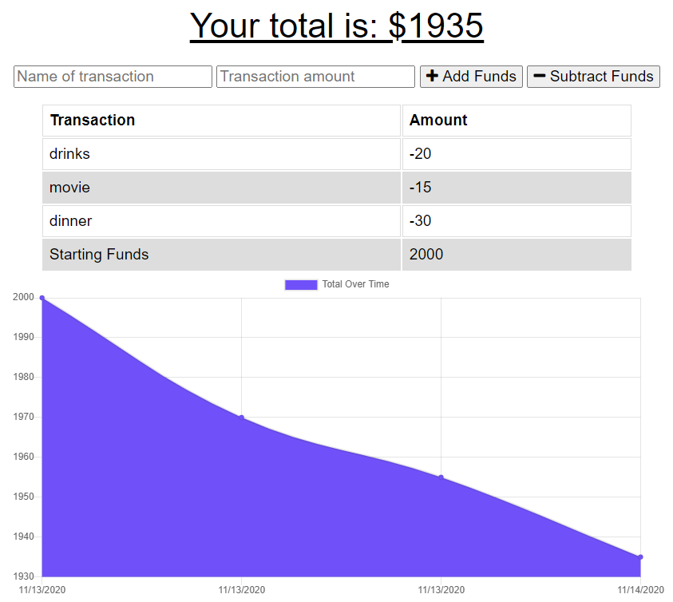

# Stacks on Deck
  

  ## Description
  A budget tracker that with online and offline functionality.

  ## Deployed Site
  [Stacks on Deck](https://stacks-on-deck34.herokuapp.com/)
  

  ## Table of Contents
  
  | [Installation](#installation) |
  | [Use](#use) |
  | [Test Instructions](#test-instructions) |
  | [License Information](#license-information) |
    
  ## Installation
  Application is deployed through heroku otherwise the packages required to run this program are: express, mongoose, morgan, compression.
  
  ## Use
  An app that allows a traveller to track their expenses and stay on budget regardless of internet connection.
  
  ## Test Instructions
  n/a
  
  ## License Information
  This is licensed under the unlicense

  